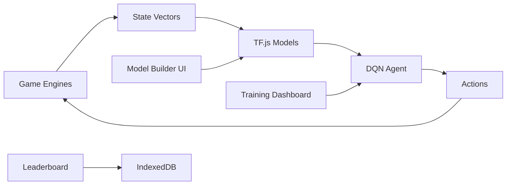

# ModelArena

> Build, train, and battle your own neural networks against classic games — entirely in the browser.


<!-- Screenshot placeholder -->
<!--  -->

## How It Works

```
1. Pick a Game    →  Choose from Snake, Flappy Bird, CartPole, 2048, or Chess
2. Design Model   →  Visually stack layers (Dense, Conv2D, Dropout, etc.)
3. Train It       →  Watch your model learn in real-time with live metrics
4. Watch It Play  →  See your neural network make decisions with Q-value overlays
```

## Architecture



Everything runs **100% client-side**. No backend, no API keys, no GPU required.

## Games

| Game | Difficulty | Type | Inputs | Actions |
|------|-----------|------|--------|---------|
| 🐍 Snake | Starter | Classification | 20 | 4 (Up/Down/Left/Right) |
| 🐦 Flappy Bird | Intermediate | Continuous Control | 6 | 2 (Flap/Don't) |
| ⚖️ CartPole | Classic | RL Benchmark | 4 | 2 (Left/Right) |
| 🔢 2048 | Intermediate | Planning | 20 | 4 (Up/Down/Left/Right) |
| ♟️ Chess | Advanced | Strategic Reasoning | 780 | 1 (Eval Score) |

## What You'll Learn

- **Snake**: Basic RL, state representation, reward shaping
- **Flappy Bird**: Temporal dependencies, why deeper isn't always better
- **CartPole**: Classic control theory, hyperparameter sensitivity
- **2048**: Stochastic environments, feature engineering
- **Chess**: ML as a component (eval function in minimax search), supervised learning

## Tech Stack

- **Frontend**: React 19 + Vite
- **Styling**: TailwindCSS 4 + Framer Motion
- **ML**: TensorFlow.js (in-browser inference & training)
- **State**: Zustand
- **Charts**: Recharts
- **Visualization**: Canvas-based network topology + game renderers
- **Storage**: localStorage (leaderboard) + IndexedDB (model weights)

## Local Development

```bash
git clone <repo-url>
cd modelarena
npm install
npm run dev
```

## Features

- **Visual Model Builder** — Drag-and-drop layer stacking with live shape propagation
- **Real-time Training** — Live reward curves, loss plots, and epsilon decay
- **Decision Overlay** — See Q-values and model confidence for every action
- **Human vs AI** — Play games yourself or watch the model play
- **Leaderboard** — Track architectures, compare scores, chase achievement tiers
- **Contextual Hints** — Detects plateaus and oscillations, suggests improvements
- **Concept Glossary** — Searchable explanations of every ML concept used
- **Per-game Tutorials** — Step-by-step walkthroughs for each game

## Contributing

1. Fork the repo
2. Create a feature branch (`git checkout -b feature/amazing-feature`)
3. Commit your changes
4. Open a Pull Request

## License

MIT
