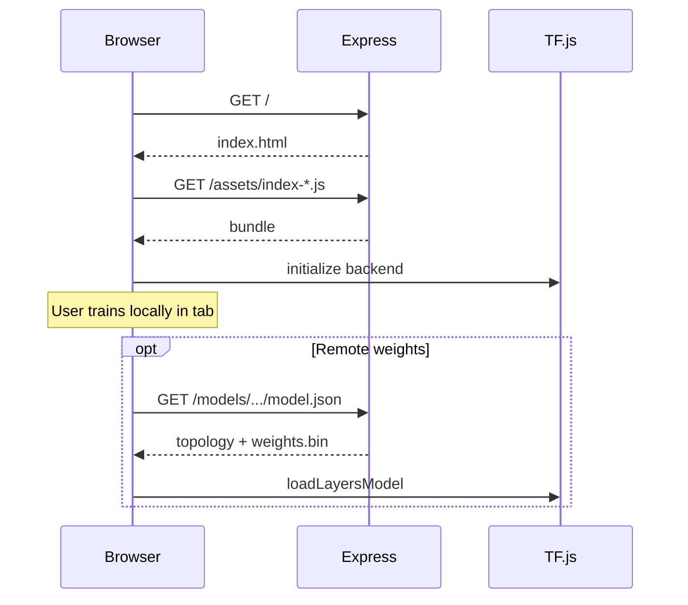

# ModelArena — Complete Technical Stack Reference

> **Purpose:** Exhaustive architecture reference from browser boot through Docker production, game MDPs, DQN math, persistence, and deployment.  
> **Audience:** Engineers onboarding to the repo or authoring assessment tasks against this codebase.

---

## Table of contents

1. [System overview](#1-system-overview)
2. [Technology inventory](#2-technology-inventory)
3. [Repository map](#3-repository-map)
4. [Runtime topologies](#4-runtime-topologies)
5. [Build & bundling (Vite)](#5-build--bundling-vite)
6. [Application bootstrap & routing](#6-application-bootstrap--routing)
7. [Design system (Tailwind v4)](#7-design-system-tailwind-v4)
8. [Client state (Zustand)](#8-client-state-zustand)
9. [UI shell & view routing](#9-ui-shell--view-routing)
10. [Feature surfaces (components)](#10-feature-surfaces-components)
11. [Game layer — contract & catalog](#11-game-layer--contract--catalog)
12. [Per-game MDP specifications](#12-per-game-mdp-specifications)
13. [Renderers vs engines](#13-renderers-vs-engines)
14. [Neural architecture builder](#14-neural-architecture-builder)
15. [TensorFlow.js & backends](#15-tensorflowjs--backends)
16. [DQN agent — algorithms & tensors](#16-dqn-agent--algorithms--tensors)
17. [Training loop & scheduling](#17-training-loop--scheduling)
18. [Supervised chess path](#18-supervised-chess-path)
19. [Pretrained models & quick-train](#19-pretrained-models--quick-train)
20. [Model persistence & export](#20-model-persistence--export)
21. [Playback & inference](#21-playback--inference)
22. [Leaderboard & analytics](#22-leaderboard--analytics)
23. [Express server](#23-express-server)
24. [Docker image pipeline](#24-docker-image-pipeline)
25. [Assessment / zip constraints](#25-assessment--zip-constraints)
26. [End-to-end sequence diagrams](#26-end-to-end-sequence-diagrams)
27. [Extension points & known limits](#27-extension-points--known-limits)

---

## 1. System overview

ModelArena is a **single-page educational RL laboratory**:

| Concern | Where it lives |
|--------|----------------|
| UX / pedagogy | React 19 + Framer Motion |
| Game physics & rewards | Plain JS `*Engine` classes |
| Policy learning | TensorFlow.js in the **browser main thread** |
| Trained weights | IndexedDB (primary), optional HTTP `/models/*` (server) |
| High scores / run history | `localStorage` |
| Production hosting | Optional Express 5 serving `dist/` + TF.js artifacts |

**Not present:** Python training, GPU servers, databases, auth, WebSocket sync, multi-user arenas.

**Core user journey:**

```
Welcome (/) → pick game → /app
  → Builder: stack layers, validate shapes
  → Train: DQN or supervised chess
  → Play: greedy policy replay, human mode, pretrained
  → Leaderboard: compare runs per game
```

---

## 2. Technology inventory

### 2.1 Frontend (`package.json`)

| Package | Version (approx) | Role |
|---------|------------------|------|
| `react` / `react-dom` | 19.x | UI runtime |
| `react-router-dom` | 7.x | `/`, `/app`, `/demo` |
| `vite` | 8.x | Dev server + production bundle |
| `@vitejs/plugin-react` | 6.x | Fast Refresh, JSX |
| `@tailwindcss/vite` + `tailwindcss` | 4.x | Utility CSS via `@import "tailwindcss"` |
| `@tensorflow/tfjs` | 4.22.x | Layers API, training, IO |
| `zustand` | 5.x | Global stores |
| `framer-motion` | 12.x | Layout transitions |
| `@hello-pangea/dnd` | 18.x | Layer reorder |
| `recharts` | 3.x | Training curves |
| `d3` | 7.x | `NetworkGraph` |
| `uuid` | 13.x | Layer IDs |

### 2.2 Server (`server/package.json`)

| Package | Role |
|---------|------|
| `express` | 5.x HTTP server |
| `cors` | Cross-origin for split dev setups |

### 2.3 Tooling

- **ESLint 9** flat config (`eslint.config.js`)
- **Node ESM** everywhere (`"type": "module"`)

---

## 3. Repository map

```
modelarena/
├── index.html                 # Vite HTML shell
├── package.json               # Frontend dependencies
├── package-lock.json
├── vite.config.js             # plugins: react(), tailwindcss()
├── vercel.json                # SPA rewrite → index.html
├── Dockerfile                 # node:20-alpine multi-stage
├── .dockerignore              # MUST NOT list .git
├── docs/
│   └── STACK.md               # This document
├── public/                    # Static assets (favicon, etc.)
├── src/
│   ├── main.jsx
│   ├── App.jsx
│   ├── index.css              # @theme tokens + utilities
│   ├── components/
│   │   ├── layout/            # MainLayout, Sidebar, TopBar
│   │   ├── builder/           # ModelBuilder, layers, save/load
│   │   ├── training/          # TrainingPanel, charts, hyperparams
│   │   ├── playback/          # GamePlayback, overlays, human vs AI
│   │   ├── leaderboard/       # Leaderboard, comparison, export
│   │   ├── welcome/           # WelcomeScreen, GuidedTour
│   │   ├── demo/              # DemoView
│   │   ├── learning/          # Glossary, tutorials, explainers
│   │   └── viz/               # NetworkGraph, ActivationVisualizer
│   ├── games/
│   │   ├── GameEngine.js      # Abstract base
│   │   ├── snake/
│   │   ├── flappy/
│   │   ├── cartpole/
│   │   ├── twentyfortyeight/
│   │   └── chess/
│   ├── ml/
│   │   ├── ModelBuilder.js
│   │   ├── DQNAgent.js
│   │   ├── TrainingLoop.js
│   │   ├── SupervisedTrainer.js
│   │   ├── pretrainedModels.js
│   │   └── modelSerializer.js
│   ├── stores/                # Zustand modules
│   └── utils/                 # shapes, chess vector, themes
└── server/
    ├── index.js
    ├── package.json
    ├── package-lock.json
    ├── generate-models.js     # Offline TF.js artifact writer
    └── models/
        ├── snake-snakebot-v1/
        │   ├── model.json
        │   └── weights.bin
        └── cartpole-balancebot/
            ├── model.json
            └── weights.bin
```

---

## 4. Runtime topologies

### 4.1 Local development

```
Developer machine
  npm run dev
    → Vite :5173 (default)
      → Browser loads ESM from /src/main.jsx
      → TF.js uses WebGL/CPU backend in tab
      → No Express required
```

Training, IndexedDB, and leaderboard work entirely client-side.

### 4.2 Docker production

```
docker build → image
  Stage frontend-builder: npm ci && vite build → /app/dist
  Stage production:
    WORKDIR /app (server root)
    npm ci --omit=dev (server only)
    COPY dist → ./public
    CMD node index.js
    PORT default 3001

Browser → http://host:3001/
  GET /assets/*     → Vite hashed bundles from public/
  GET /api/health   → JSON
  GET /api/models   → catalog
  GET /models/...   → TF.js files
  GET /app, /foo    → index.html (SPA fallback)
```

Single origin: no CORS configuration needed for same-host API/model loads.

### 4.3 Vercel (optional static)

`vercel.json` rewrites all paths to `index.html`. **Does not** deploy `server/` unless configured separately. TF.js remote weights on Vercel would need another host or serverless static files.

---

## 5. Build & bundling (Vite)

### 5.1 Config (`vite.config.js`)

```js
export default defineConfig({
  plugins: [react(), tailwindcss()],
})
```

- No custom `base` → assets served from `/`.
- No dev proxy to Express (frontend does not call API by default).

### 5.2 Production output

`npm run build` produces:

```
dist/
  index.html
  assets/
    index-<hash>.js    # ~1.9MB minified (TF.js + games + UI)
    index-<hash>.css   # Tailwind compiled
```

Vite 8 may warn about chunk size > 500kB; no code-splitting configured.

### 5.3 Module graph entry

`index.html` → `src/main.jsx` → `App.jsx` → feature components → engines/ml.

Tree-shaking applies; entire TF.js namespace is still large.

---

## 6. Application bootstrap & routing

### 6.1 `main.jsx`

```jsx
createRoot(document.getElementById('root')).render(
  <StrictMode>
    <BrowserRouter>
      <App />
    </BrowserRouter>
  </StrictMode>
)
```

`StrictMode` double-invokes effects in dev only.

### 6.2 `App.jsx` routes

| Path | Component | Notes |
|------|-----------|-------|
| `/` | `WelcomeScreen` | Marketing, game selection, CTA to `/app` |
| `/app` | `AppShell` | `MainLayout` + optional `GuidedTour` |
| `/demo` | `DemoView` | Isolated demo experience |
| `*` | `<Navigate to="/" />` | Unknown URLs → home |

**Important:** Inside `/app`, navigation between Builder / Train / Play / Leaderboard is **not** URL-based — it uses `useGameStore().view`.

### 6.3 Guided tour gating

`shouldShowTour.js`:

```js
export function shouldShowTour() {
  return !localStorage.getItem('modelarena-tour-completed')
}
```

Tour completion should set `modelarena-tour-completed` (see `GuidedTour.jsx`).

---

## 7. Design system (Tailwind v4)

### 7.1 `index.css` structure

1. Google Fonts: Inter, JetBrains Mono, Space Grotesk, Material Symbols.
2. `@import "tailwindcss"`.
3. `@theme { ... }` — CSS variables consumed as Tailwind colors.

### 7.2 Semantic tokens (excerpt)

| Token | Hex / value | Usage |
|-------|-------------|--------|
| `bg-primary` | `#0b0b0e` | Page background |
| `primary` | `#aaffdc` | Neural green accent |
| `secondary` | `#6e9bff` | Blue accent |
| `tertiary` | `#e966ff` | Purple accent |
| `accent-snake` | `#22C55E` | Game theming |
| `accent-flappy` | `#F97316` | |
| `accent-cartpole` | `#3B82F6` | |
| `accent-2048` | `#A855F7` | |
| `accent-chess` | `#EAB308` | |

Utility classes like `glass-panel`, `grid-bg`, `font-label` are defined in the same file.

### 7.3 Motion

`MainLayout` wraps view content in `AnimatePresence` + `motion.div` with opacity/y transitions keyed on `view`.

---

## 8. Client state (Zustand)

### 8.1 `useGameStore` — `src/stores/useGameStore.js`

**`GAMES` registry** (metadata driving UI + ML I/O):

| `id` | `inputSize` | `outputSize` | `trainingMode` | Tier example |
|------|-------------|--------------|----------------|--------------|
| `snake` | 20 | 4 | RL (default) | bronze 30 / silver 50 / gold 80 |
| `flappy` | 6 | 2 | RL | pipes passed |
| `cartpole` | 4 | 2 | RL | steps survived; `solvedThreshold: 195` |
| `twentyfortyeight` | 20 | 4 | RL | tile value thresholds |
| `chess` | 780 | 1 | **`supervised`** | beat random / material / PST |

**State fields:**

- `activeGameId` — which MDP is active.
- `view` — `builder` | `train` | `play` | `leaderboard`.
- `gameState` — optional mirror (mostly engines local to panels).
- `isPlaying`, `playbackSpeed` — playback helpers.

**`setActiveGame(gameId)`** resets `gameState` and `isPlaying`.

### 8.2 `useModelStore` — `src/stores/useModelStore.js`

**Layer types & defaults:**

```js
dense:     { type: 'dense', units: 64, activation: 'relu' }
conv2d:    { filters: 32, kernelSize: 3, padding: 'same', ... }
dropout:   { rate: 0.2 }
batchnorm: { type: 'batchnorm' }
flatten:   { type: 'flatten' }
activation:{ activation: 'relu' }
```

**Presets:**

| Key | Architecture intent |
|-----|---------------------|
| `starter` | 2× Dense 32 |
| `deep` | 128-128-dropout-64-64 |
| `wide` | 256-dropout-256 |
| `cnn` | 2× Conv2d + flatten + dense + dropout |

**`savedWeightsKey`** — IndexedDB URI suffix after save/chess train.

**`reorderLayers`** — used by `@hello-pangea/dnd` in `ModelBuilder`.

### 8.3 `useTrainingStore` — `src/stores/useTrainingStore.js`

**Hyperparameters (defaults):**

| Key | Default | Consumed by |
|-----|---------|-------------|
| `learningRate` | 0.001 | Adam in DQN / supervised |
| `batchSize` | 32 | Replay sampling |
| `epsilon` | 1.0 | Initial exploration |
| `epsilonDecay` | 0.995 | Per train step |
| `epsilonMin` | 0.01 | Floor |
| `replayBufferSize` | 10000 | Ring buffer capacity |
| `gamma` | 0.99 | Bellman discount |
| `targetUpdateFreq` | 100 | Hard target sync |
| `maxEpisodes` | 1000 | Outer training loop |
| `maxStepsPerEpisode` | 500 | Inner loop cap |

**Metrics arrays:** `episodeRewards`, `losses`, `rollingAvg` (20-episode MA).

### 8.4 `useLeaderboardStore` — `src/stores/useLeaderboardStore.js`

**Storage key:** `modelarena-leaderboard`

**Shape:**

```json
{
  "snake": [
    {
      "id": "uuid",
      "timestamp": 1730000000000,
      "modelName": "My Model",
      "bestScore": 42,
      "architecture": "dense → dense",
      "episodes": 100,
      "layerCount": 2,
      "rewardHistory": [...],
      "lossHistory": [...]
    }
  ],
  "flappy": [...]
}
```

Sorted descending by `bestScore` on insert.

---

## 9. UI shell & view routing

### 9.1 `MainLayout.jsx`

```
┌─────────────────────────────────────────────┐
│ Sidebar │ TopBar                            │
│         ├───────────────────────────────────│
│         │ AnimatePresence(view)             │
│         │   builder | train | play | board  │
└─────────────────────────────────────────────┘
```

Ambient decorative blurs (`bg-primary/5`, `bg-tertiary/3`).

### 9.2 `Sidebar.jsx` / `TopBar.jsx`

- Switch `activeGameId` (game icons / labels).
- Set `view` to builder/train/play/leaderboard.
- Display game accent via `getGameAccentHex(activeGameId)`.

---

## 10. Feature surfaces (components)

### 10.1 Builder stack

| File | Responsibility |
|------|----------------|
| `ModelBuilder.jsx` | Orchestrates palette, layer list, presets, param count |
| `LayerPalette.jsx` | Add layer buttons |
| `LayerCard.jsx` | Edit units, activation, rate |
| `ArchitecturePresets.jsx` | Preset chips |
| `ShapePropagator.jsx` | Visual shape pipeline |
| `ModelSaveLoad.jsx` | Import/export, saved model list (localStorage keys list) |
| `NetworkGraph.jsx` | D3 graph of layers |
| `GameTutorial.jsx` | Per-game copy |

**Validation path:** `calculateShapes(layers, getInputShape(gameId))` → errors block mentally (alert on train if empty).

**Complexity label:** `<50k` Simple, `<500k` Moderate, else Complex params.

### 10.2 Training stack

| File | Responsibility |
|------|----------------|
| `TrainingPanel.jsx` | Start/stop, engine factory, loop lifecycle |
| `HyperparamConfig.jsx` | Binds to `useTrainingStore.hyperparams` |
| `TrainingCharts.jsx` | Recharts reward/loss |
| `TrainingHints.jsx` | Contextual tips |

**Start flow (RL):**

1. Auto `loadPreset('starter')` if no layers (chess → `deep`).
2. `useTrainingStore.startTraining()`.
3. `new TrainingLoop(engine, layers, gameId, outputSize, hp, callbacks)`.
4. `loop.start()` async — no await in UI (fire-and-forget).

**Callbacks:**

- `onStep` — every step; UI updates every 10 steps for perf.
- `onEpisodeEnd` — `addEpisodeReward(score)`.
- `onTrainingEnd` — `stopTraining`, `addEntry` leaderboard.

**Chess branch:** `SupervisedTrainer` + `saveChessSessionWeights` on end.

### 10.3 Playback stack

| File | Responsibility |
|------|----------------|
| `GamePlayback.jsx` | Intervals, model loading priority |
| `DecisionOverlay.jsx` | Q-value bars on snake |
| `PretrainedModelSelector.jsx` | Quick-train / load UI |
| `HumanVsModel.jsx` | Split control modes |

### 10.4 Learning / welcome

- `ConceptGlossary.jsx` — ML term definitions.
- `LayerExplainer.jsx` — Per-layer pedagogy.
- `WelcomeScreen.jsx` — Large marketing layout, routes to `/app`.

---

## 11. Game layer — contract & catalog

### 11.1 Abstract `GameEngine`

```js
class GameEngine {
  reset()           // → stateVector
  step(action)      // → { state, reward, done, score? }
  getState()        // → rich object for renderer
  getStateVector()  // → number[] for NN
  getScore()
  isDone()
  getSteps()
  getActionSpace()  // config.outputSize
}
```

**Design rule:** Engines are **deterministic given RNG seeds** except where `Math.random()` is used (spawns, cartpole init).

### 11.2 Engine factory pattern

Duplicated in `TrainingPanel` and `GamePlayback`:

```js
function createEngine(gameId) {
  switch (gameId) {
    case 'snake': return new SnakeEngine()
    // ...
  }
}
```

---

## 12. Per-game MDP specifications

### 12.1 Snake (`SnakeEngine` + `snakeConfig.js`)

**Grid:** 20×20, initial length 3.

**Actions (discrete):** 0=Up, 1=Down, 2=Left, 3=Right. Cannot reverse 180° in one step.

**Rewards:**

| Event | Value |
|-------|-------|
| Eat food | +10 |
| Death (wall/self/starvation) | -10 |
| Per step | -0.1 |
| Manhattan distance to food improved | +0.1 |
| Distance worsened | -0.15 |

**Termination:** wall, self-collision, or `stepsWithoutFood >= 100`.

**State vector (20 dims):**

1. Danger straight / right / left (binary×3)
2. Direction one-hot (4)
3. Food direction flags (4)
4. Normalized head y, distances to walls (4)
5. Normalized Δfood x/y (2)
6. Snake length / grid cells (1)
7. Starvation timer ratio (1)
8. Score / 50 (1)

**Score:** count of food eaten.

### 12.2 Flappy (`FlappyEngine` + `flappyConfig.js`)

**World:** 350×500 px logical space.

**Actions:** 0=no flap, 1=flap (`flapForce = -8`).

**Physics:** gravity 0.5 per step; pipes spawn every 90 frames; speed 2.5 px/frame.

**Rewards:** +0.01 survival; +1 per pipe passed; -1 on crash.

**State vector (6 dims):** normalized bird y, velocity, distances/gaps to next two pipes (see `getStateVector` in source).

**Score:** pipes passed.

### 12.3 CartPole (`CartPoleEngine` + `cartpoleConfig.js`)

**Classic dynamics:** cart position `x`, velocity `xDot`, pole angle `theta`, angular velocity `thetaDot`.

**Action:** 0 = force left, 1 = force right (`forceMag` from config).

**Reward:** +1 per surviving step.

**Termination:** `|x| > xThreshold` or `|theta| > thetaThreshold`.

**State vector (4):** each variable scaled by threshold/3 for roughly [-1,1] inputs.

**Score:** step count (CartPole-v1 style).

### 12.4 2048 (`TwentyFortyEightEngine`)

**Grid:** 4×4, spawn 2 (90%) or 4 (10%).

**Actions:** 0–3 map to up/down/left/right via grid rotation + compress/merge on left.

**Implementation detail:** Uses `_rotateGrid` so one merge implementation serves all directions.

**Rewards:** merge values added to reward signal (see engine `step`).

**State vector:** 20 dims encoding tile patterns (see `getStateVector`).

**Score:** sum of merge values / max tile metrics.

### 12.5 Chess (`ChessEngine` + supervised pipeline)

**Board:** 8×8 integer piece codes (white 1–6, black 7–12).

**Move generation:** Full legal move gen with check detection (`isInCheck`, `isSquareAttacked`).

**RL mode:** Not used for DQN in production UI — `trainingMode: 'supervised'`.

**Evaluation head:** Single scalar in [-1,1] via `tanh` output (from `ModelBuilder` when `outputSize === 1`).

**State vector (780):** For each of 64 squares, 12-dim one-hot piece type (`boardToVector` in `chessBoardVector.js`). Padded/truncated to 780.

**Play:** `engine.step(0, evalFn)` — minimax/search uses NN eval if weights loaded, else material/PST fallback.

---

## 13. Renderers vs engines

| Game | Renderer file | Input |
|------|---------------|-------|
| Snake | `SnakeRenderer.jsx` | `gameState`, optional `qValues` |
| Flappy | `FlappyRenderer.jsx` | bird + pipes |
| CartPole | `CartPoleRenderer.jsx` | pole/cart geometry |
| 2048 | `TwentyFortyEightRenderer.jsx` | grid + merge flash |
| Chess | `ChessRenderer.jsx` | board array |

Renderers are **read-only**; they never call `train()`.

---

## 14. Neural architecture builder

### 14.1 `buildModel(layers, gameId, outputSize)`

1. `inputShape = getInputShape(gameId)`.
2. `calculateShapes` — if errors, throw before TF build.
3. `tf.sequential()` — append user layers.
4. Final `dense(outputSize, activation: outputSize===1 ? 'tanh' : 'linear')`.

**Supported layer types in TF build:**

- `dense`, `conv2d`, `flatten`, `dropout`, `batchnorm`, `activation`

### 14.2 Shape propagation (`shapeCalculator.js`)

| Layer | Output shape rule |
|-------|-------------------|
| `dense` | `[units]` — requires 1D input |
| `conv2d` | same H×W if `padding:'same'`, else valid shrink |
| `flatten` | `[product(in)]` |
| `dropout/batchnorm/activation` | unchanged |

**Parameter estimate:** hand-counted matmul + conv kernels + final output layer.

### 14.3 CNN + vector games

Snake/flappy/cartpole/2048 use **1D vectors** by default — CNN preset is for experimentation; conv2d on 1D input will error unless input reshaped (not automatic).

---

## 15. TensorFlow.js & backends

### 15.1 Backend selection

TF.js auto-selects **WebGL** when available, else **CPU**. No explicit `setBackend` in repo.

### 15.2 Memory discipline

- `tf.tidy()` around predict passes in agent and playback.
- `trainOnBatch` tensors explicitly `dispose()` after use.
- **Critical comment in DQN:** `getWeights()` returns live tensors — never `dispose()` those references.

### 15.3 IO handlers

| URI scheme | Use |
|------------|-----|
| `indexeddb://modelarena-...` | Save/load in browser |
| `downloads://filename` | Browser download export |
| HTTP `/models/.../model.json` | Server static (optional load via `remoteUrl`) |

---

## 16. DQN agent — algorithms & tensors

### 16.1 Class structure (`DQNAgent.js`)

- `onlineModel` — trained every step.
- `targetModel` — periodic copy of online weights.
- `ReplayBuffer` — array-backed ring buffer.

### 16.2 Action selection

```
if random() < epsilon:
  return uniform action
else:
  Q = onlineModel.predict(state)
  return argmax(Q)
```

`forceGreedy=true` skips ε (playback).

### 16.3 Double DQN target (per transition)

```
If done:
  target[a] = r
Else:
  a* = argmax_a Q_online(s')
  target[a] = r + γ * Q_target(s', a*)
```

Loss: MSE between current Q(s,a) and target vector (only taken action updated).

### 16.4 Training step

1. Sample batch size `batchSize` (unique indices via Set).
2. `tf.tidy` → build `targetData`, `stateData` arrays.
3. `trainOnBatch(statesTensor, targetTensor)`.
4. Every `targetUpdateFreq` steps: `targetModel.setWeights(online.getWeights())`.
5. `epsilon *= epsilonDecay` (floor `epsilonMin`).

### 16.5 Hyperparameter interaction

All `hp` keys merged with defaults in constructor; training loop passes store snapshot at construction time (not live-bound mid-run unless restarted).

---

## 17. Training loop & scheduling

### 17.1 Pseudocode

```
for ep in 0..maxEpisodes-1:
  state = engine.reset()
  for step in 0..maxStepsPerEpisode-1:
    while paused: sleep 100ms
    if !running: break
    a = agent.selectAction(state)
    { state', r, done } = engine.step(a)
    agent.storeExperience(state, a, r, state', done)
    loss = await agent.train()
    callbacks.onStep(...)
    if done: break
    if step % 4 == 0: await setTimeout(0)  // yield UI thread
  callbacks.onEpisodeEnd(...)
callbacks.onTrainingEnd()
```

### 17.2 UI coupling

`TrainingPanel` reads loss/epsilon into store; charts subscribe to store arrays.

**Confetti:** `useTrainingStore.subscribe` detects new `bestScore` peaks during training.

---

## 18. Supervised chess path

### 18.1 `SupervisedTrainer`

- Builds `buildModel(layers, 'chess', 1)`.
- `LABELED_POSITIONS` from `chessPositions.js` — each `{ board, eval }`.
- 80/20 split; `model.fit` with validation.
- Callback `onEpoch` with `loss`, `valLoss`.

### 18.2 TrainingPanel chess UX

Every 5 epochs: spawn demo `ChessEngine`, run 10 plies with `model.predict(boardToVector(board))` as eval.

On end: `saveChessSessionWeights` → `setSavedWeightsKey`.

### 18.3 Metric reuse

`addEpisodeReward(1 - valLoss)` — repurposes RL chart for classification/regression loss visibility.

---

## 19. Pretrained models & quick-train

### 19.1 `PRETRAINED_MODELS` registry

Per game id: `layers`, `hyperparams`, `expectedScore`, `tier`, marketing `description`.

IDs like `snake-snakebot-v1`, `cartpole-balancebot`.

### 19.2 Load order (`loadPretrainedModel`)

1. IndexedDB `pretrained-{modelId}` if `tf.io.listModels()` contains key.
2. Else `config.remoteUrl` HTTP load + cache to IndexedDB.
3. Else null → user must quick-train.

### 19.3 `quickTrainModel`

Runs full `DQNAgent` training in-browser with progress callback; saves to IndexedDB on completion.

---

## 20. Model persistence & export

### 20.1 Functions (`modelSerializer.js`)

| API | Behavior |
|-----|----------|
| `saveModel(model, gameId, name)` | `indexeddb://modelarena-{game}-{slug}` |
| `loadModel(key)` | `tf.loadLayersModel` |
| `exportModel` | Custom JSON with embedded weight bytes |
| `exportStandardTfjsModel` | Native TF.js download bundle |
| `importModel(file)` | Parse JSON → `fromMemory` loader |

### 20.2 `ModelSaveLoad.jsx`

- Lists keys from `localStorage` `modelarena-saved-models` metadata array.
- Coordinates with `savedWeightsKey` for playback priority.

---

## 21. Playback & inference

### 21.1 Model source priority (`startAI`)

**Chess:**

1. Load `savedWeightsKey` from IndexedDB → NN eval callback.
2. Else minimax with material eval (`engine.step(0)`).

**RL:**

1. If `savedWeightsKey` → load layers model, greedy `argmax Q` each tick.
2. Else if layers exist → `new DQNAgent(...)` **untrained** + `selectAction(state, true)`.
3. Pretrained path: `loadPretrainedModel` / `startWithModel`.

### 21.2 Timing

`setInterval(..., speed)` — default speed state ~200ms; chess minimum 300ms.

### 21.3 Human mode

`startHuman` — keyboard handlers in component (game-specific); engine steps on input.

---

## 22. Leaderboard & analytics

**Entry creation:** `leaderboardSnapshot(modelName, layers)` pulls training store metrics at session end.

**Comparison:** `ModelComparison.jsx` overlays `rewardHistory` curves (last N points).

**Export:** `ModelExport.jsx` can export run metadata (see component for format).

---

## 23. Express server

### 23.1 Middleware order

1. `cors()`
2. `express.json()`
3. `/models` static + Cache-Control 1 day
4. `/api/models` JSON catalog
5. `/api/health`
6. If `./public/index.html` exists: static assets + SPA `GET *`

### 23.2 Catalog entries (hardcoded)

- `snake-snakebot-v1` → `/models/snake-snakebot-v1/model.json`
- `cartpole-balancebot` → `/models/cartpole-balancebot/model.json`

### 23.3 `generate-models.js`

Offline script writing Keras-style `modelTopology` + `weights.bin` (random weights unless you train separately). Documents that real trained weights require running the browser training loop and exporting.

---

## 24. Docker image pipeline

### 24.1 Dockerfile stages

```dockerfile
FROM node:20-alpine AS frontend-builder
WORKDIR /app
COPY package.json package-lock.json ./
RUN npm ci
COPY . .
RUN npm run build

FROM node:20-alpine AS production
WORKDIR /app
ENV NODE_ENV=production
COPY server/package.json server/package-lock.json ./
RUN npm ci --omit=dev
COPY server/index.js ./
COPY server/models ./models
COPY --from=frontend-builder /app/dist ./public
EXPOSE 3001
CMD ["node", "index.js"]
```

### 24.2 Filesystem layout in container

```
/app/
  index.js
  package.json
  node_modules/   (express, cors only)
  models/
  public/         (Vite dist)
    index.html
    assets/
```

### 24.3 Environment variables

| Var | Default | Effect |
|-----|---------|--------|
| `PORT` | 3001 | Listen port |
| `NODE_ENV` | production in image | Standard Node hint |

---

## 25. Assessment / zip constraints

When submitting to platforms that reset git state:

1. Zip must include **`.git/`** (GitHub “Download ZIP” does **not**).
2. `.dockerignore` must **not** exclude `.git`.
3. Dockerfile rules: pinned `FROM`, ≤200 lines, ≤30 `RUN`, `COPY` destinations under allowed prefixes, lockfile-driven `npm ci`, etc.

**Build locally:**

```bash
docker build -t modelarena .
docker run --rm -p 3001:3001 modelarena
```

---

## 26. End-to-end sequence diagrams

### 26.1 RL training (mermaid)

```mermaid
sequenceDiagram
  participant UI as TrainingPanel
  participant Loop as TrainingLoop
  participant Eng as GameEngine
  participant Ag as DQNAgent
  participant TF as TensorFlow.js

  UI->>Loop: start()
  Loop->>Eng: reset()
  Eng-->>Loop: state vector
  loop each step
    Loop->>Ag: selectAction(state)
    Ag->>TF: predict (tidy)
    Loop->>Eng: step(action)
    Eng-->>Loop: reward, next state, done
    Loop->>Ag: storeExperience
    Loop->>Ag: train()
    Ag->>TF: trainOnBatch
    Loop->>UI: onStep callback
  end
  Loop->>UI: onTrainingEnd
  UI->>UI: leaderboard addEntry
```

### 26.2 Production page load



---

## 27. Extension points & known limits

### 27.1 Natural extensions

- Wire `PRETRAINED_MODELS[*].remoteUrl` to `/api/models` URLs.
- Add Vite `server.proxy` for dev API.
- Web Worker wrapper around `TrainingLoop` for UI jank reduction.
- Split TF.js via dynamic `import()` to shrink initial chunk.
- Persist leaderboard to server (not implemented).

### 27.2 Known limits

- Training blocks main thread (mitigated by periodic `setTimeout(0)`).
- Server model weights may be **placeholders** unless regenerated with real training.
- No automated tests in repo for engines/agents.
- Chess full rules are heavy; supervised set size is fixed in `chessPositions.js`.
- ε and hyperparams not synced live from UI after loop starts.

---

## Appendix A — File → responsibility quick index

| Path | One-line role |
|------|----------------|
| `src/main.jsx` | React mount + router |
| `src/App.jsx` | Top routes |
| `src/ml/DQNAgent.js` | Double DQN |
| `src/ml/TrainingLoop.js` | Episode driver |
| `src/ml/ModelBuilder.js` | Sequential TF model |
| `src/stores/useGameStore.js` | Game catalog + view |
| `src/components/training/TrainingPanel.jsx` | Train UI orchestration |
| `src/components/playback/GamePlayback.jsx` | Inference loops |
| `server/index.js` | HTTP static + API |
| `Dockerfile` | Production image |

---

## Appendix B — localStorage keys

| Key | Purpose |
|-----|---------|
| `modelarena-leaderboard` | Leaderboard JSON |
| `modelarena-saved-models` | Saved model metadata list |
| `modelarena-tour-completed` | Guided tour flag |

---

## Appendix C — IndexedDB model key patterns

| Pattern | Example |
|---------|---------|
| User save | `modelarena-snake-my-model` |
| Pretrained | `pretrained-snake-snakebot-v1` |
| Chess session | `modelarena-chess-_session_` |

---

*Last aligned to repo commit containing Dockerfile, Express `public/` serving, and five-game catalog.*
